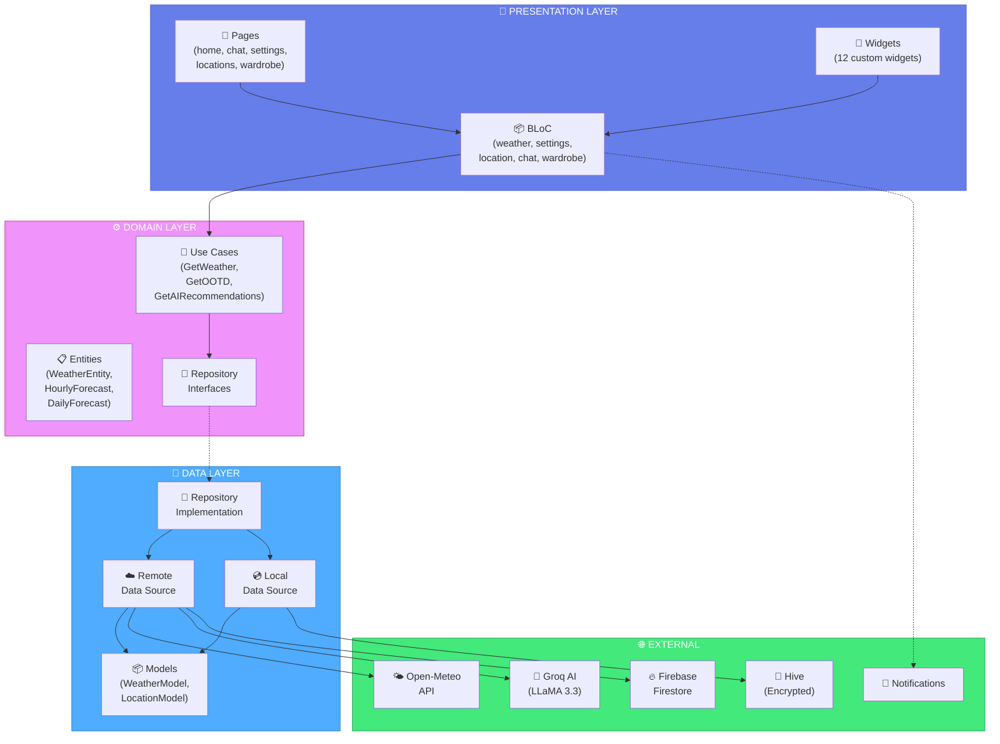

<!-- =====================================================================
     ╔═══════════════════════════════════════════════════════════════════╗
     ║  🌤️  SIÊU THỜI TIẾT - Super Weather Pro                         ║
     ║  ━━━━━━━━━━━━━━━━━━━━━━━━━━━━━━━━━━━━━━━━━━━━━━━━━━━━━━━━━━━━━━━  ║
     ║  A Professional Flutter Weather Application                       ║
     ║  Developed by DANGIT (Trần Đình Đăng) | Đại học Hà Tĩnh          ║
     ║  Version: 1.0.0 | Last Updated: December 2024                     ║
     ╚═══════════════════════════════════════════════════════════════════╝
     ===================================================================== -->

<div align="center">

<!-- Animated Header with Weather Theme -->


<br/>

<!-- Feature Highlights Banner -->
<table>
<tr>
<td align="center">🌡️ <b>Dự báo thời tiết chính xác</b></td>
<td align="center">🤖 <b>Tích hợp AI gợi ý trang phục</b></td>
<td align="center">📱 <b>Đa nền tảng: Android • iOS • Web</b></td>
</tr>
</table>

<br/>

<!-- Main Badges with Weather Theme Colors -->
<p>
  
  
  
  
</p>

<!-- Project Stats Badges -->
<p>
  
  
  
  
</p>

<!-- Tech Stack Badges -->
<p>
  
  
  
  
</p>

<br/>

<!-- Weather Icons Animation Row -->
<p>
  
  
  
  
  
  
  
</p>

<br/>

<!-- Quick Navigation with Styled Links -->
<p>
  <a href="#-quick-start"><kbd>⚡ Quick Start</kbd></a>&nbsp;&nbsp;
  <a href="#-tổng-quan"><kbd>📖 Tổng Quan</kbd></a>&nbsp;&nbsp;
  <a href="#-highlights"><kbd>✨ Highlights</kbd></a>&nbsp;&nbsp;
  <a href="#-tính-năng-chi-tiết"><kbd>🎯 Tính Năng</kbd></a>&nbsp;&nbsp;
  <a href="#%EF%B8%8F-công-nghệ"><kbd>🛠️ Công Nghệ</kbd></a>&nbsp;&nbsp;
  <a href="#%EF%B8%8F-kiến-trúc"><kbd>🏗️ Kiến Trúc</kbd></a>&nbsp;&nbsp;
  <a href="#-tác-giả"><kbd>👨‍💻 Tác Giả</kbd></a>&nbsp;&nbsp;
  <a href="CONTRIBUTING.md"><kbd>🤝 Đóng Góp</kbd></a>&nbsp;&nbsp;
  <a href="AUTHORS.md"><kbd>📜 Authors</kbd></a>
</p>

<br/>

<!-- Decorative Line -->


</div>

<br/>

<!-- ══════════════════════════════════════════════════════════════════════════ -->
<!-- ═══════════════════════ SECTION: QUICK START ═════════════════════════════ -->
<!-- ══════════════════════════════════════════════════════════════════════════ -->

## ⚡ Quick Start

<div align="center">

```bash
# 1️⃣ Clone the repository (thay URL bằng repository của bạn)
git clone <https://github.com/nhaico12345/thoitiet-supperman> && cd sieuthoitiet

# 2️⃣ Install dependencies
flutter pub get

# 3️⃣ Run the app
flutter run
```

<br/>

<table>
<tr>
<td>

**📱 Android APK**

```bash
flutter build apk --release
```

</td>
<td>

**🍎 iOS Build**

```bash
flutter build ios --release
```

</td>
<td>

**🌐 Web Build**

```bash
flutter build web --release
```

</td>
</tr>
</table>

</div>

<br/>

<!-- ══════════════════════════════════════════════════════════════════════════ -->
<!-- ═══════════════════════ SECTION: TỔNG QUAN ═══════════════════════════════ -->
<!-- ══════════════════════════════════════════════════════════════════════════ -->

## 📖 Tổng Quan


**Siêu Thời Tiết** (Super Weather Pro) là ứng dụng dự báo thời tiết **thế hệ mới** được phát triển hoàn toàn bằng **Flutter**, tích hợp **Trí tuệ nhân tạo (AI)** để mang đến trải nghiệm xem thời tiết thông minh và cá nhân hóa cho người dùng Việt Nam.

### 🎯 Mục Tiêu Dự Án

| Mục tiêu | Mô tả |
|:--------:|:------|
| 🌡️ **Chính xác** | Dữ liệu thời tiết real-time từ Open-Meteo API |
| 🤖 **Thông minh** | Tích hợp Groq AI (LLaMA 3.3 70B) để gợi ý thông minh |
| 📴 **Offline First** | Hoạt động mượt mà ngay cả khi không có mạng |
| 🔐 **Bảo mật** | Mã hóa dữ liệu với AES cipher |
| 🎨 **Đẹp mắt** | UI/UX hiện đại với animation động |

<br clear="right"/>

<div align="center">

> 💡 *"Không chỉ xem thời tiết — mà còn hiểu thời tiết và được AI tư vấn trang phục!"*

</div>

<br/>

<!-- ══════════════════════════════════════════════════════════════════════════ -->
<!-- ═══════════════════════ SECTION: HIGHLIGHTS ══════════════════════════════ -->
<!-- ══════════════════════════════════════════════════════════════════════════ -->

## ✨ Highlights

<div align="center">

<table>
<tr>
<td align="center" width="25%">
🤖<br/><b>Groq AI</b>
<br/><sub>LLaMA 3.3 70B với<br/>4 fallback models</sub>
</td>
<td align="center" width="25%">
🌡️<br/><b>14+ Chỉ Số</b>
<br/><sub>Nhiệt độ, UV, AQI,<br/>Độ ẩm, Gió...</sub>
</td>
<td align="center" width="25%">
📱<br/><b>Home Widget</b>
<br/><sub>Widget màn hình<br/>chính Android</sub>
</td>
<td align="center" width="25%">
📅<br/><b>Calendar Sync</b>
<br/><sub>Tích hợp lịch<br/>thiết bị tự động</sub>
</td>
</tr>
<tr>
<td align="center">
👕<br/><b>OOTD AI</b>
<br/><sub>Gợi ý trang phục<br/>theo thời tiết</sub>
</td>
<td align="center">
📈<br/><b>FL Chart</b>
<br/><sub>Biểu đồ nhiệt độ<br/>tương tác đẹp</sub>
</td>
<td align="center">
🔔<br/><b>Smart Alerts</b>
<br/><sub>Cảnh báo thời tiết<br/>nguy hiểm</sub>
</td>
<td align="center">
📤<br/><b>Share Card</b>
<br/><sub>Chia sẻ ảnh thời<br/>tiết đẹp mắt</sub>
</td>
</tr>
</table>

</div>

<br/>

<!-- ══════════════════════════════════════════════════════════════════════════ -->
<!-- ═══════════════════════ SECTION: DEMO & SCREENSHOTS ═════════════════════ -->
<!-- ══════════════════════════════════════════════════════════════════════════ -->

## 📱 Demo & Screenshots

<div align="center">

<!-- App Stats Cards -->
<table>
<tr>
<td align="center" width="25%">

<br/><sub><b>Feature Files</b></sub>
</td>
<td align="center" width="25%">

<br/><sub><b>Dart Code</b></sub>
</td>
<td align="center" width="25%">

<br/><sub><b>Custom UI</b></sub>
</td>
<td align="center" width="25%">

<br/><sub><b>Core Services</b></sub>
</td>
</tr>
</table>

<br/>

### 🖼️ App Screens Preview

<!-- Mock Screenshots Grid -->
<table>
<tr>
<td align="center" width="33%">

**🏠 Home Dashboard**

```
┌─────────────────────┐
│  ☀️ 28°C           │
│  Hà Tĩnh, VN       │
│  ─────────────────  │
│  💧 75%  💨 12km/h │
│  ☀️ UV: 6  📊 AQI  │
│  ─────────────────  │
│  [Hourly Forecast]  │
│  08  09  10  11  12 │
│  28  29  30  31  30 │
│  ─────────────────  │
│  [Daily Forecast]   │
│  T2  T3  T4  T5  T6 │
└─────────────────────┘
```

</td>
<td align="center" width="33%">

**🤖 AI Chat**

```
┌─────────────────────┐
│  💬 Weather AI      │
│  ─────────────────  │
│  👤 Hôm nay mặc gì? │
│                     │
│  🤖 Với nhiệt độ    │
│     28°C và nắng,   │
│     bạn nên mặc:    │
│     • Áo phông      │
│     • Quần short    │
│     • Mũ chống nắng │
│     • Kem chống nắng│
│  ─────────────────  │
│  [Type message...] 📤│
└─────────────────────┘
```

</td>
<td align="center" width="33%">

**👕 Tủ Đồ & OOTD**

```
┌─────────────────────┐
│  👗 Virtual Wardrobe │
│  ─────────────────  │
│  📸 Thêm trang phục │
│                     │
│  🤖 Gợi ý AI        │
│     Dựa trên 28°C   │
│     và trời nắng:   │
│     • Áo phông      │
│     • Quần short    │
│     • Mũ chống nắng │
│  ─────────────────  │
│  🔥 Firebase Sync   │
└─────────────────────┘
```

</td>
</tr>
</table>

<br/>

### 🌈 Theme Support

<table>
<tr>
<td align="center" width="50%">

**☀️ Light Mode**


Clean, bright interface với<br/>màu sắc tươi sáng

</td>
<td align="center" width="50%">

**🌙 Dark Mode**


Giao diện tối, dễ chịu<br/>cho mắt vào ban đêm

</td>
</tr>
</table>

</div>

<br/>

<!-- ══════════════════════════════════════════════════════════════════════════ -->
<!-- ═══════════════════════ SECTION: KEY METRICS ════════════════════════════ -->
<!-- ══════════════════════════════════════════════════════════════════════════ -->

## 📈 Key Metrics

<div align="center">

```
╔══════════════════════════════════════════════════════════════════════════════╗
║                           📊 PROJECT STATISTICS                              ║
╠══════════════════════════════════════════════════════════════════════════════╣
║                                                                              ║
║   📁 Project Structure          │   📦 Dependencies                         ║
║   ─────────────────────────────────────────────────────────────────────────  ║
║   • lib/                  99 files  │  • Production deps      30 packages   ║
║   • core/services/        10 files  │  • Dev dependencies      8 packages   ║
║   • features/             73 files  │  • Total packages       38 packages   ║
║   • widgets/              12 files  │                                       ║
║                                                                              ║
║   🔧 Core Components            │   🎯 Feature Modules (5)                  ║
║   ─────────────────────────────────────────────────────────────────────────  ║
║   • BLoC states            4 blocs  │  • home/        36 files (Dashboard)  ║
║   • Entities               5 types  │  • chat/         6 files (AI Chat)    ║
║   • Use cases              5 funcs  │  • locations/   11 files (GPS)        ║
║   • Repository impl        5 repos  │  • settings/     9 files (Prefs)      ║
║                                     │  • wardrobe/    11 files (Virtual)    ║
║                                                                              ║
║   🤖 AI Configuration           │   🔐 Security & Cloud                     ║
║   ─────────────────────────────────────────────────────────────────────────  ║
║   • Primary model   llama-3.3-70b   │  • Database       Firebase Firestore  ║
║   • Fallback #1     llama-3.1-8b    │  • Image storage  Cloudinary CDN      ║
║   • Fallback #2     gemma2-9b-it    │  • Local storage  Hive (encrypted)    ║
║   • Fallback #3     mixtral-8x7b    │  • Key storage    FlutterSecureStorage║
║                                                                              ║
╚══════════════════════════════════════════════════════════════════════════════╝
```

</div>

<br/>

<!-- ══════════════════════════════════════════════════════════════════════════ -->
<!-- ═══════════════════════ SECTION: TÍNH NĂNG CHI TIẾT ═════════════════════ -->
<!-- ══════════════════════════════════════════════════════════════════════════ -->

## 🎯 Tính Năng Chi Tiết

### 🌡️ 1. Dữ Liệu Thời Tiết Toàn Diện

<details open>
<summary><b>📊 WeatherEntity — 14 Chỉ Số Thời Tiết</b></summary>

<br/>

Ứng dụng thu thập và hiển thị **14 chỉ số thời tiết** từ Open-Meteo API:

| # | Chỉ Số | Đơn Vị | Mô Tả |
|:-:|:-------|:------:|:------|
| 1 | 🌡️ `temperature` | °C/°F | Nhiệt độ hiện tại |
| 2 | 🤒 `feelsLike` | °C/°F | Nhiệt độ cảm nhận thực tế |
| 3 | 💨 `windSpeed` | km/h | Tốc độ gió |
| 4 | 💧 `humidity` | % | Độ ẩm không khí |
| 5 | 📊 `pressure` | hPa | Áp suất khí quyển |
| 6 | ☀️ `uvIndex` | 0-11+ | Chỉ số tia UV (nguy hiểm) |
| 7 | 🌬️ `aqi` | 0-500 | Chất lượng không khí (AQI) |
| 8 | 🌅 `sunrise` | HH:mm | Thời gian bình minh |
| 9 | 🌇 `sunset` | HH:mm | Thời gian hoàng hôn |
| 10 | 🔢 `weatherCode` | WMO | Mã thời tiết quốc tế |
| 11 | 📍 `locationName` | Text | Tên địa điểm |
| 12 | ⏰ `lastUpdated` | ISO8601 | Thời gian cập nhật |
| 13 | 📈 `hourlyForecasts` | List | Dự báo 24 giờ |
| 14 | 📅 `dailyForecasts` | List | Dự báo 10 ngày |

</details>

<details>
<summary><b>⏰ HourlyForecast — Dự Báo Theo Giờ</b></summary>

<br/>

| Field | Type | Mô Tả |
|:------|:----:|:------|
| `time` | String | Thời gian (ISO8601) |
| `temperature` | double | Nhiệt độ dự báo |
| `precipitationProbability` | int | % khả năng mưa |
| `weatherCode` | int | Mã thời tiết WMO |

</details>

<details>
<summary><b>📅 DailyForecast — Dự Báo 10 Ngày</b></summary>

<br/>

| Field | Type | Mô Tả |
|:------|:----:|:------|
| `date` | String | Ngày (ISO8601) |
| `maxTemp` | double | Nhiệt độ cao nhất |
| `minTemp` | double | Nhiệt độ thấp nhất |
| `weatherCode` | int | Mã thời tiết WMO |
| `uvMax` | double | Chỉ số UV cao nhất |

</details>

<br/>

---

### 🤖 2. Trí Tuệ Nhân Tạo (AI)

<details open>
<summary><b>🧠 GroqService — 4 AI Models với Fallback Thông Minh</b></summary>

<br/>

Ứng dụng sử dụng **Groq AI** với chiến lược **multi-model fallback**:

```
┌─────────────────────────────────────────────────────────────────────────┐
│  🧠 GROQ AI SERVICE — Intelligent Model Fallback System                │
├─────────────────────────────────────────────────────────────────────────┤
│                                                                         │
│   Primary Model                  Fallback Models                       │
│   ┌──────────────────┐           ┌──────────────────┐                  │
│   │ LLaMA 3.3 70B    │ ────────► │ LLaMA 3.1 8B     │                  │
│   │ (Versatile)       │  Fail?   │ (Instant)        │                  │
│   └──────────────────┘           └────────┬─────────┘                  │
│                                           │ Fail?                      │
│                                           ▼                            │
│                                  ┌──────────────────┐                  │
│                                  │ Mixtral 8x7B     │                  │
│                                  │ (32K context)    │                  │
│                                  └────────┬─────────┘                  │
│                                           │ Fail?                      │
│                                           ▼                            │
│                                  ┌──────────────────┐                  │
│                                  │ GPT-OSS 120B     │                  │
│                                  │ (Final fallback) │                  │
│                                  └──────────────────┘                  │
│                                                                         │
│   ✓ Auto retry với exponential backoff (500ms → 1000ms)                │
│   ✓ Max retries: 2 per model                                           │
│   ✓ Timeout: 30 seconds                                                │
│                                                                         │
└─────────────────────────────────────────────────────────────────────────┘
```

| Model | Parameters | Đặc Điểm | Ưu Tiên |
|:------|:----------:|:---------|:-------:|
| **LLaMA 3.3 70B** | 70B | Đa năng, chất lượng cao | 🥇 Primary |
| **LLaMA 3.1 8B** | 8B | Nhanh, instant response | 🥈 Fallback 1 |
| **Gemma2 9B IT** | 9B | Google model, nhẹ | 🥉 Fallback 2 |
| **Mixtral 8x7B** | 46.7B | Context dài 32K tokens | 4️⃣ Fallback 3 |

</details>

<details>
<summary><b>💬 ChatPage — Trò Chuyện với AI</b></summary>

<br/>

Tính năng **AI Chat** cho phép người dùng trò chuyện trực tiếp với AI về thời tiết:

| Component | Mô Tả |
|:----------|:------|
| `ChatPage` | Trang chat chính với BLoC |
| `ChatView` | Giao diện chat (StatefulWidget) |
| `_MessageBubble` | Bong bóng tin nhắn (user/AI) |
| `_TypingIndicator` | Hiệu ứng "đang gõ..." |

**Tính năng:**
- 💬 Chat real-time với AI
- ⌨️ Typing indicator animation
- 📜 Auto-scroll to bottom
- 🕐 Timestamp cho mỗi tin nhắn

</details>

<details>
<summary><b>👕 OOTD — Outfit of the Day</b></summary>

<br/>

AI tự động gợi ý trang phục phù hợp dựa trên:

- 🌡️ Nhiệt độ hiện tại và cảm nhận
- 🌧️ Khả năng mưa
- ☀️ Chỉ số UV
- 💨 Tốc độ gió

</details>

<br/>

---

### 📱 3. Widgets & UI Components

<details open>
<summary><b>🎨 12 Custom Widgets</b></summary>

<br/>

| # | Widget | File | Mô Tả |
|:-:|:-------|:-----|:------|
| 1 | 🃏 **Current Weather Card** | `current_weather_card.dart` | Card thời tiết hiện tại |
| 2 | ⏰ **Hourly Forecast** | `hourly_forecast_widget.dart` | Dự báo theo giờ (7.6KB) |
| 3 | 📅 **Daily Forecast** | `daily_forecast_widget.dart` | Dự báo 10 ngày |
| 4 | 🌬️ **AQI Widget** | `aqi_widget.dart` | Chất lượng không khí |
| 5 | 🌡️ **Environmental Grid** | `environmental_grid_widget.dart` | Lưới các chỉ số môi trường |
| 6 | 💡 **Recommendation** | `recommendation_widget.dart` | Gợi ý AI (8.9KB) |
| 7 | 🖼️ **Shareable Card** | `shareable_weather_card.dart` | Card chia sẻ (11.5KB) |
| 8 | 🎬 **Weather Background** | `weather_background_widget.dart` | Nền động thời tiết |
| 9 | 💀 **Weather Skeleton** | `weather_skeleton_widget.dart` | Loading skeleton |
| 10 | 📝 **Weather Summary** | `weather_summary_card.dart` | Tóm tắt AI |
| 11 | 📅 **Calendar Warning** | `calendar_weather_warning_card.dart` | Cảnh báo lịch (7.3KB) |
| 12 | 🕐 **Last Updated Banner** | `last_updated_banner.dart` | Banner cập nhật |

</details>

<br/>

---

### ⚙️ 4. Core Services (10 Services)

<details open>
<summary><b>🔧 Service Architecture</b></summary>

<br/>

```
┌─────────────────────────────────────────────────────────────────┐
│                    📦 CORE SERVICES (lib/core/services/)       │
├─────────────────────────────────────────────────────────────────┤
│                                                                 │
│  ┌─────────────────┐  ┌─────────────────┐  ┌─────────────────┐ │
│  │ 🤖 AI Service   │  │ 🔔 Notification │  │ ⚡ Background   │ │
│  │   (3.8KB)       │  │    (6.7KB)      │  │    (7.1KB)      │ │
│  │                 │  │                 │  │                 │ │
│  │ • Groq API      │  │ • Local notif   │  │ • WorkManager   │ │
│  │ • 4 AI models   │  │ • Scheduling    │  │ • Periodic sync │ │
│  │ • Smart retry   │  │ • Deep links    │  │ • Battery safe  │ │
│  └─────────────────┘  └─────────────────┘  └─────────────────┘ │
│                                                                 │
│  ┌─────────────────┐  ┌─────────────────┐  ┌─────────────────┐ │
│  │ 📱 Home Widget  │  │ 📅 Calendar     │  │ ⚠️ Alert        │ │
│  │   (6.3KB)       │  │   (6.8KB)       │  │   (6.4KB)       │ │
│  │                 │  │                 │  │                 │ │
│  │ • Android widget│  │ • Device cal    │  │ • Weather alerts│ │
│  │ • Deep linking  │  │ • Auto events   │  │ • Severity level│ │
│  │ • Auto refresh  │  │ • Reminders     │  │ • Hive storage  │ │
│  └─────────────────┘  └─────────────────┘  └─────────────────┘ │
│                                                                 │
│  ┌─────────────────┐  ┌─────────────────┐  ┌─────────────────┐ │
│  │ 📤 Share        │  │ 📱 Device       │  │ ☁️ Cloudinary   │ │
│  │   (8.7KB)       │  │   (1.8KB)       │  │   (2.7KB)       │ │
│  │                 │  │                 │  │                 │ │
│  │ • SharePlus     │  │ • Device info   │  │ • Image upload  │ │
│  │ • Screenshot    │  │ • Platform      │  │ • Wardrobe pics │ │
│  │ • Social share  │  │ • Model name    │  │ • CDN delivery  │ │
│  └─────────────────┘  └─────────────────┘  └─────────────────┘ │
│                                                                 │
│  ┌─────────────────┐                                            │
│  │ 👗 Outfit       │                                            │
│  │   (5.8KB)       │                                            │
│  │                 │                                            │
│  │ • AI suggest    │                                            │
│  │ • Weather match │                                            │
│  │ • Wardrobe sync │                                            │
│  └─────────────────┘                                            │
│                                                                 │
└─────────────────────────────────────────────────────────────────┘
```

| Service | Size | Chức Năng Chính |
|:--------|:----:|:----------------|
| `ai_service.dart` | 3.8KB | Gọi Groq AI với 4-model fallback |
| `notification_service.dart` | 6.6KB | Local notifications, scheduling |
| `background_service.dart` | 5.7KB | WorkManager, periodic sync |
| `home_widget_service.dart` | 6.5KB | Android home widget, deep links |
| `calendar_service.dart` | 6.9KB | Device calendar integration |
| `alert_service.dart` | 6.6KB | Weather alerts, severity tracking |
| `share_service.dart` | 8.7KB | SharePlus, screenshot capture |
| `device_service.dart` | 1.9KB | Device info, platform detection |
| `cloudinary_service.dart` | 2.7KB | Image upload lên Cloudinary CDN |
| `outfit_recommendation_service.dart` | 5.8KB | Gợi ý trang phục theo thời tiết |

</details>

<br/>

---

### � 5. Tủ Đồ Ảo (Virtual Wardrobe)

<details open>
<summary><b>� Wardrobe Feature — Firebase + Cloudinary + AI</b></summary>

<br/>

Tính năng **Tủ Đồ Ảo** cho phép người dùng:

| Component | Mô Tả |
|:----------|:------|
| `ClothingItem` | Entity quần áo với 10 thuộc tính |
| `WardrobeRepository` | Lưu trữ Firebase Firestore |
| `CloudinaryService` | Upload ảnh lên CDN |
| `OutfitRecommendationService` | Gợi ý theo thời tiết |

**Thuộc tính ClothingItem:**
- `id`, `name`, `category` (T-Shirt, Hoodie, Jacket...)
- `warmthLevel` (1-10: mỏng → dày)
- `imageUrl` (Cloudinary CDN)
- `material`, `style`, `gender`
- `contributedBy`, `createdAt`

</details>

<br/>

---

### 🔐 6. Bảo Mật

<details open>
<summary><b>🛡️ Security Features</b></summary>

<br/>

```dart
// Secure encryption key generation (main.dart)
const secureStorage = FlutterSecureStorage();
final encryptionKeyString = await secureStorage.read(key: 'hive_key');

if (encryptionKeyString == null) {
  final key = Hive.generateSecureKey();  // 256-bit key
  await secureStorage.write(key: 'hive_key', value: base64UrlEncode(key));
}

// Encrypted Hive box for history
await Hive.openBox(
  'history_logs',
  encryptionCipher: HiveAesCipher(encryptionKey),  // AES-256
);
```

| Component | Phương Thức | Mô Tả |
|:----------|:------------|:------|
| 🔑 **Key Storage** | FlutterSecureStorage | Lưu encryption key an toàn |
| 🔒 **Data Encryption** | HiveAesCipher (AES-256) | Mã hóa history logs |
| 🎲 **Key Generation** | Hive.generateSecureKey() | Tạo 256-bit random key |
| 📝 **Encoding** | base64UrlEncode | Encode key cho storage |

</details>

<br/>

<!-- ══════════════════════════════════════════════════════════════════════════ -->
<!-- ═══════════════════════ SECTION: CÔNG NGHỆ ═══════════════════════════════ -->
<!-- ══════════════════════════════════════════════════════════════════════════ -->

## 🛠️ Công Nghệ

<div align="center">

### 💎 Core Technologies

<br/>

<table>
<tr>
<td align="center" width="120">

<br/><b>Flutter</b>
<br/><sub>3.9+</sub>
</td>
<td align="center" width="120">

<br/><b>Dart</b>
<br/><sub>3.0+</sub>
</td>
<td align="center" width="120">

<br/><b>Android</b>
<br/><sub>API 21+</sub>
</td>
<td align="center" width="120">

<br/><b>iOS</b>
<br/><sub>12.0+</sub>
</td>
<td align="center" width="120">

<br/><b>Web</b>
<br/><sub>Chrome, Edge</sub>
</td>
</tr>
</table>

</div>

<br/>

### 📦 Full Dependency List (30+ Packages)

<details>
<summary><b>🎯 State Management & Architecture (4 packages)</b></summary>

| Package | Version | Mục Đích |
|:--------|:-------:|:---------|
| `flutter_bloc` | ^9.1.1 | BLoC state management |
| `equatable` | ^2.0.7 | Value equality for entities |
| `get_it` | ^9.1.1 | Dependency injection (Service Locator) |
| `go_router` | ^17.0.0 | Navigation và routing |

</details>

<details>
<summary><b>🌐 Networking & HTTP (4 packages)</b></summary>

| Package | Version | Mục Đích |
|:--------|:-------:|:---------|
| `dio` | ^5.9.0 | HTTP client mạnh mẽ |
| `dio_smart_retry` | ^7.0.1 | Auto retry với exponential backoff |
| `connectivity_plus` | ^7.0.0 | Network state detection |
| `http` | ^1.2.2 | Simple HTTP requests (cho Groq API) |

</details>

<details>
<summary><b>💾 Local Storage (4 packages)</b></summary>

| Package | Version | Mục Đích |
|:--------|:-------:|:---------|
| `hive` | ^2.2.3 | NoSQL local database |
| `hive_flutter` | ^1.1.0 | Hive Flutter integration |
| `flutter_secure_storage` | ^9.2.4 | Encrypted key storage |
| `shared_preferences` | ^2.5.3 | Simple key-value storage |

</details>

<details>
<summary><b>🗺️ Location & Maps (3 packages)</b></summary>

| Package | Version | Mục Đích |
|:--------|:-------:|:---------|
| `geolocator` | ^14.0.2 | GPS location tracking |
| `geocoding` | ^4.0.0 | Address geocoding/reverse |
| `permission_handler` | ^12.0.1 | Runtime permissions |

</details>

<details>
<summary><b>🎨 UI & Animations (5 packages)</b></summary>

| Package | Version | Mục Đích |
|:--------|:-------:|:---------|
| `lottie` | ^3.3.2 | Lottie animations |
| `fl_chart` | ^1.1.1 | Charts (Line, Bar, Pie) |
| `flutter_weather_bg_null_safety` | ^1.0.0 | Weather background effects |
| `cupertino_icons` | ^1.0.8 | iOS-style icons |
| `screenshot` | ^3.0.0 | Widget screenshot capture |

</details>

<details>
<summary><b>📱 Platform Features (5 packages)</b></summary>

| Package | Version | Mục Đích |
|:--------|:-------:|:---------|
| `flutter_local_notifications` | ^19.5.0 | Local push notifications |
| `workmanager` | ^0.9.0+3 | Background task scheduling |
| `home_widget` | ^0.8.1 | Android home screen widget |
| `device_calendar` | ^4.3.3 | Device calendar access |
| `device_info_plus` | ^12.3.0 | Device information |

</details>

<details>
<summary><b>🤖 AI & Utilities (5 packages)</b></summary>

| Package | Version | Mục Đích |
|:--------|:-------:|:---------|
| `google_generative_ai` | ^0.4.7 | Google Gemini AI (backup) |
| `share_plus` | ^12.0.1 | Social sharing |
| `uuid` | ^4.5.2 | UUID generation |
| `timezone` | ^0.10.1 | Timezone handling |
| `path_provider` | ^2.1.2 | File system paths |

</details>

<details>
<summary><b>🔥 Firebase & Cloud (4 packages)</b></summary>

| Package | Version | Mục Đích |
|:--------|:-------:|:---------|
| `firebase_core` | ^4.3.0 | Firebase initialization |
| `cloud_firestore` | ^6.1.1 | Cloud Firestore database |
| `cloudinary_api` | ^1.1.1 | Cloudinary API integration |
| `cloudinary_url_gen` | ^1.8.0 | Cloudinary URL generation |

</details>

<details>
<summary><b>👗 Wardrobe Feature (2 packages)</b></summary>

| Package | Version | Mục Đích |
|:--------|:-------:|:---------|
| `image_picker` | ^1.1.2 | Camera/gallery image selection |
| `cached_network_image` | ^3.4.1 | Cached image loading |

</details>

<details>
<summary><b>🧪 Dev Dependencies (6 packages)</b></summary>

| Package | Version | Mục Đích |
|:--------|:-------:|:---------|
| `flutter_test` | SDK | Widget testing |
| `integration_test` | SDK | E2E testing |
| `flutter_lints` | ^5.0.0 | Code linting rules |
| `bloc_test` | ^10.0.0 | BLoC testing utilities |
| `mocktail` | ^1.0.4 | Mocking for tests |
| `build_runner` | ^2.4.13 | Code generation |
| `hive_generator` | ^2.0.1 | Hive adapters generation |
| `flutter_launcher_icons` | ^0.14.1 | App icon generation |

</details>

<br/>

<!-- ══════════════════════════════════════════════════════════════════════════ -->
<!-- ═══════════════════════ SECTION: KIẾN TRÚC ═══════════════════════════════ -->
<!-- ══════════════════════════════════════════════════════════════════════════ -->

## 🏗️ Kiến Trúc

<div align="center">

### Clean Architecture + Feature-First

</div>

<br/>



<br/>

### 📂 Project Structure

```
sieuthoitiet/
│
├── 📂 lib/
│   │
│   ├── 📂 core/                              # ═══ 🔧 CORE LAYER ═══
│   │   │
│   │   ├── 📂 database/                      # Hive database setup
│   │   │
│   │   ├── 📂 di/                            # Dependency Injection
│   │   │   └── injection_container.dart      # GetIt service locator
│   │   │
│   │   ├── 📂 error/                         # Error handling
│   │   │   └── exceptions.dart               # Custom exceptions
│   │   │
│   │   ├── 📂 network/                       # Networking
│   │   │   ├── api_client.dart               # Dio HTTP client
│   │   │   ├── api_constants.dart            # API endpoints
│   │   │   └── network_info.dart             # Connectivity check
│   │   │
│   │   ├── 📂 router/                        # Navigation
│   │   │   └── app_router.dart               # GoRouter config
│   │   │
│   │   ├── 📂 services/                      # ═══ 10 SERVICES ═══
│   │   │   ├── ai_service.dart               # 🤖 Groq AI (3.8KB)
│   │   │   ├── alert_service.dart            # ⚠️ Weather alerts (6.6KB)
│   │   │   ├── background_service.dart       # ⚡ WorkManager (5.7KB)
│   │   │   ├── calendar_service.dart         # 📅 Calendar sync (6.9KB)
│   │   │   ├── cloudinary_service.dart       # ☁️ Image upload (2.7KB)
│   │   │   ├── device_service.dart           # 📱 Device info (1.9KB)
│   │   │   ├── home_widget_service.dart      # 🏠 Android widget (6.5KB)
│   │   │   ├── notification_service.dart     # 🔔 Notifications (6.6KB)
│   │   │   ├── outfit_recommendation_service.dart # 👗 Outfit AI (5.8KB)
│   │   │   └── share_service.dart            # 📤 Sharing (8.7KB)
│   │   │
│   │   ├── 📂 theme/                         # Theming
│   │   │   └── app_theme.dart                # Light/Dark themes
│   │   │
│   │   └── 📂 utils/                         # Utilities
│   │       ├── unit_converter.dart           # °C↔°F, km/h↔mph
│   │       └── weather_icons.dart            # WMO code to icon
│   │
│   ├── 📂 features/                          # ═══ 🎯 FEATURE MODULES ═══
│   │   │
│   │   ├── 📂 home/                          # 🏠 HOME (36 files)
│   │   │   ├── 📂 data/
│   │   │   │   ├── datasources/
│   │   │   │   ├── models/
│   │   │   │   │   └── weather_model.dart    # + Hive adapters
│   │   │   │   └── repositories/
│   │   │   ├── 📂 domain/
│   │   │   │   ├── entities/
│   │   │   │   │   ├── weather.dart          # WeatherEntity (14 props)
│   │   │   │   │   └── weather_alert.dart    # AlertEntity
│   │   │   │   ├── repositories/
│   │   │   │   └── usecases/
│   │   │   │       ├── get_weather.dart
│   │   │   │       ├── get_ootd.dart
│   │   │   │       ├── get_ai_recommendations.dart
│   │   │   │       └── get_weather_summary.dart
│   │   │   └── 📂 presentation/
│   │   │       ├── bloc/
│   │   │       │   ├── weather_bloc.dart
│   │   │       │   ├── weather_event.dart
│   │   │       │   └── weather_state.dart
│   │   │       ├── pages/
│   │   │       │   ├── home_page.dart        # Main dashboard (10.7KB)
│   │   │       │   └── layouts/
│   │   │       │       ├── home_mobile_layout.dart
│   │   │       │       └── home_tablet_layout.dart
│   │   │       └── widgets/                  # ═══ 12 WIDGETS ═══
│   │   │           ├── current_weather_card.dart
│   │   │           ├── hourly_forecast_widget.dart
│   │   │           ├── daily_forecast_widget.dart
│   │   │           ├── aqi_widget.dart
│   │   │           ├── environmental_grid_widget.dart
│   │   │           ├── recommendation_widget.dart
│   │   │           ├── shareable_weather_card.dart
│   │   │           ├── weather_background_widget.dart
│   │   │           ├── weather_skeleton_widget.dart
│   │   │           ├── weather_summary_card.dart
│   │   │           ├── calendar_weather_warning_card.dart
│   │   │           └── last_updated_banner.dart
│   │   │
│   │   ├── 📂 chat/                          # 💬 AI CHAT (6 files)
│   │   │   ├── 📂 domain/entities/
│   │   │   │   └── chat_message.dart
│   │   │   └── 📂 presentation/
│   │   │       ├── bloc/chat_bloc.dart
│   │   │       └── pages/chat_page.dart      # Chat UI (8.4KB)
│   │   │
│   │   ├── 📂 locations/                     # 📍 LOCATIONS (11 files)
│   │   │   ├── 📂 data/
│   │   │   │   ├── datasources/
│   │   │   │   ├── models/location_model.dart
│   │   │   │   └── repositories/
│   │   │   ├── 📂 domain/repositories/
│   │   │   └── 📂 presentation/
│   │   │       ├── bloc/location_bloc.dart
│   │   │       └── pages/locations_page.dart
│   │   │
│   │   ├── 📂 settings/                      # ⚙️ SETTINGS (9 files)
│   │   │   ├── 📂 data/models/settings_model.dart
│   │   │   ├── 📂 domain/
│   │   │   │   ├── entities/settings.dart    # AppThemeMode enum
│   │   │   │   └── repositories/
│   │   │   └── 📂 presentation/
│   │   │       ├── bloc/settings_bloc.dart
│   │   │       └── pages/settings_page.dart
│   │   │
│   │   └── 📂 wardrobe/                      # � WARDROBE (11 files)
│   │       ├── 📂 data/
│   │       │   ├── datasources/wardrobe_remote_data_source.dart
│   │       │   ├── models/clothing_item_model.dart
│   │       │   └── repositories/wardrobe_repository_impl.dart
│   │       ├── 📂 domain/
│   │       │   ├── entities/clothing_item.dart
│   │       │   └── repositories/wardrobe_repository.dart
│   │       └── 📂 presentation/
│   │           ├── bloc/wardrobe_bloc.dart
│   │           ├── pages/wardrobe_page.dart
│   │           └── widgets/outfit_suggestion_widget.dart
│   │
│   ├── 📂 shared/                            # 🔄 SHARED
│   │   └── 📂 widgets/
│   │       └── common_widget.dart
│   │
│   └── 📄 main.dart                          # 🚀 APP ENTRY (3.9KB)
│
├── 📂 android/                               # 🤖 Android Platform
├── 📂 ios/                                   # 🍎 iOS Platform
├── 📂 web/                                   # 🌐 Web Platform
├── 📂 test/                                  # 🧪 Tests
├── 📂 integration_test/                      # 🔗 Integration Tests
│
├── 📄 pubspec.yaml                           # 📦 Dependencies (30+)
├── 📄 analysis_options.yaml                  # 🔍 Lint rules
└── 📄 README.md                              # 📖 Documentation
```

<br/>

<!-- ══════════════════════════════════════════════════════════════════════════ -->
<!-- ═══════════════════════ SECTION: CÀI ĐẶT ═════════════════════════════════ -->
<!-- ══════════════════════════════════════════════════════════════════════════ -->

## 🚀 Cài Đặt

### 📋 Yêu Cầu Hệ Thống

| Requirement | Minimum | Recommended |
|:-----------:|:-------:|:-----------:|
| Flutter SDK | 3.9.0 | 3.24+ |
| Dart SDK | 3.0.0 | 3.5+ |
| Android SDK | API 21 | API 34 |
| iOS | 12.0 | 17.0+ |
| RAM | 4GB | 8GB+ |
| Disk | 2GB | 5GB+ |

<br/>

### 📥 Hướng Dẫn Từng Bước

<details open>
<summary><b>1️⃣ Clone Repository</b></summary>

```bash
git clone <https://github.com/nhaico12345/thoitiet-supperman>
cd sieuthoitiet
```

</details>

<details open>
<summary><b>2️⃣ Install Dependencies</b></summary>

```bash
flutter pub get
```

</details>

<details open>
<summary><b>3️⃣ Generate Code (Hive Adapters)</b></summary>

```bash
dart run build_runner build --delete-conflicting-outputs
```

</details>

<details open>
<summary><b>4️⃣ Run Application</b></summary>

```bash
# Debug mode
flutter run

# Release mode
flutter run --release
```

</details>

<details>
<summary><b>5️⃣ Build for Production</b></summary>

```bash
# Android APK
flutter build apk --release

# Android App Bundle (Play Store)
flutter build appbundle --release

# iOS
flutter build ios --release

# Web
flutter build web --release
```

</details>

<br/>

### ⚙️ Configuration (Optional)

<details>
<summary><b>🔐 Groq AI API Key</b></summary>

```dart
// lib/core/di/injection_container.dart
const groqApiKey = 'YOUR_GROQ_API_KEY';
```

Get your API key at: https://console.groq.com/keys

</details>

<br/>

<!-- ══════════════════════════════════════════════════════════════════════════ -->
<!-- ═══════════════════════ SECTION: TESTING ═════════════════════════════════ -->
<!-- ══════════════════════════════════════════════════════════════════════════ -->

## 🧪 Testing

```bash
# Run all tests
flutter test

# Run with coverage report
flutter test --coverage
genhtml coverage/lcov.info -o coverage/html

# Run integration tests
flutter test integration_test/
```

<br/>

### ✅ Test Coverage

| Category | Files | Status |
|:---------|:-----:|:------:|
| Unit Converter | `unit_converter_test.dart` | ✅ |
| Recommendation | `recommendation_service_test.dart` | ✅ |
| Weather BLoC | `weather_bloc_test.dart` | ✅ |
| Settings BLoC | `settings_bloc_test.dart` | ✅ |
| Integration | `app_test.dart` | ✅ |

<br/>

<!-- ══════════════════════════════════════════════════════════════════════════ -->
<!-- ═══════════════════════ SECTION: CONTRIBUTING ════════════════════════════ -->
<!-- ══════════════════════════════════════════════════════════════════════════ -->

## 🤝 Đóng Góp

<div align="center">

**Mọi đóng góp đều được hoan nghênh!** 🎉

</div>

<br/>

### 📋 Quy Trình

1. 🍴 **Fork** repository
2. 🌿 **Create branch**: `git checkout -b feature/amazing-feature`
3. ✍️ **Commit**: `git commit -m "feat: add amazing feature"`
4. 📤 **Push**: `git push origin feature/amazing-feature`
5. 🔃 **Pull Request**

### 📝 Commit Convention

| Type | Emoji | Mô Tả |
|:----:|:-----:|:------|
| `feat` | ✨ | Tính năng mới |
| `fix` | 🐛 | Sửa lỗi |
| `docs` | 📝 | Documentation |
| `style` | 💄 | Format/styling |
| `refactor` | ♻️ | Refactoring |
| `test` | ✅ | Tests |
| `chore` | 🔧 | Maintenance |

<br/>

<!-- ══════════════════════════════════════════════════════════════════════════ -->
<!-- ═══════════════════════ SECTION: LICENSE ═════════════════════════════════ -->
<!-- ══════════════════════════════════════════════════════════════════════════ -->

## 📄 License

<div align="center">

```
MIT License

Copyright (c) 2024 DANGIT (Trần Đình Đăng) - Đại học Hà Tĩnh

Permission is hereby granted, free of charge, to any person obtaining a copy
of this software and associated documentation files (the "Software"), to deal
in the Software without restriction, including without limitation the rights
to use, copy, modify, merge, publish, distribute, sublicense, and/or sell
copies of the Software, and to permit persons to whom the Software is
furnished to do so, subject to the following conditions:

The above copyright notice and this permission notice shall be included in all
copies or substantial portions of the Software.

THE SOFTWARE IS PROVIDED "AS IS", WITHOUT WARRANTY OF ANY KIND, EXPRESS OR
IMPLIED, INCLUDING BUT NOT LIMITED TO THE WARRANTIES OF MERCHANTABILITY,
FITNESS FOR A PARTICULAR PURPOSE AND NONINFRINGEMENT. IN NO EVENT SHALL THE
AUTHORS OR COPYRIGHT HOLDERS BE LIABLE FOR ANY CLAIM, DAMAGES OR OTHER
LIABILITY, WHETHER IN AN ACTION OF CONTRACT, TORT OR OTHERWISE, ARISING FROM,
OUT OF OR IN CONNECTION WITH THE SOFTWARE OR THE USE OR OTHER DEALINGS IN THE
SOFTWARE.
```

</div>

<br/>

<!-- ══════════════════════════════════════════════════════════════════════════ -->
<!-- ═══════════════════════ SECTION: TÁC GIẢ ═════════════════════════════════ -->
<!-- ══════════════════════════════════════════════════════════════════════════ -->

## 👨‍💻 Tác Giả

<div align="center">


<br/>

<!-- Author Profile Card -->
<table>
<tr>
<td align="center" width="200" valign="top">


<br/>

### **DANGIT**

<sub>*Full-Stack Developer*</sub>

<br/>

[](https://github.com/nhaico12345)

</td>
<td valign="top" width="400">

<br/>

| | Thông Tin |
|:--|:---------|
| 👤 **Họ và tên** | Trần Đình Đăng |
| 🎂 **Ngày sinh** | 05/05/2005 |
| 🎓 **Lớp** | K16-CNTT |
| 🏛️ **Khoa** | Kỹ thuật - Công nghệ |
| 🏫 **Trường** | **Đại học Hà Tĩnh** |
| 📍 **Địa chỉ** | TP. Hà Tĩnh, Việt Nam 🇻🇳 |

<br/>

</td>
</tr>
</table>

<br/>

### 📬 Liên Hệ

<br/>

<a href="mailto:dangitcntt55@gmail.com">
  
</a>

<a href="tel:+84962938324">
  
</a>

<br/><br/>


</div>

<br/>

<!-- ══════════════════════════════════════════════════════════════════════════ -->
<!-- ═══════════════════════ FOOTER ═══════════════════════════════════════════ -->
<!-- ══════════════════════════════════════════════════════════════════════════ -->

<div align="center">

<br/>

### 🌟 Nếu dự án hữu ích, hãy cho một ⭐ Star! 🌟

<br/>

<sub>
Made with ❤️ and ☕ by <b>DANGIT</b><br/>
Đại học Hà Tĩnh — K16-CNTT — 2024<br/>
🇻🇳 Vietnam
</sub>

<br/><br/>

[](https://flutter.dev)

<br/>

<!-- Animated Footer -->


</div>

<!-- ═══════════════════════════════════════════════════════════════════════════
     END OF README.md
     Siêu Thời Tiết - Super Weather Pro
     © 2024 DANGIT (Trần Đình Đăng) - Đại học Hà Tĩnh
     ═══════════════════════════════════════════════════════════════════════════ -->
